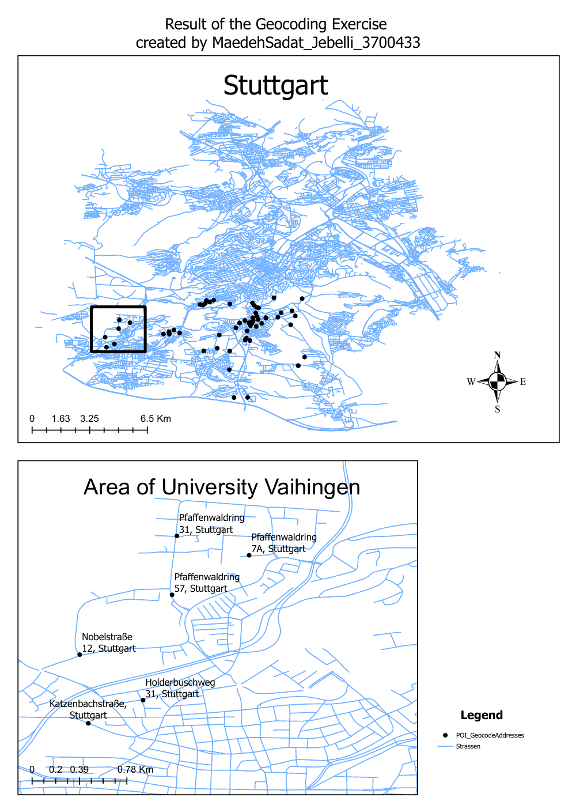
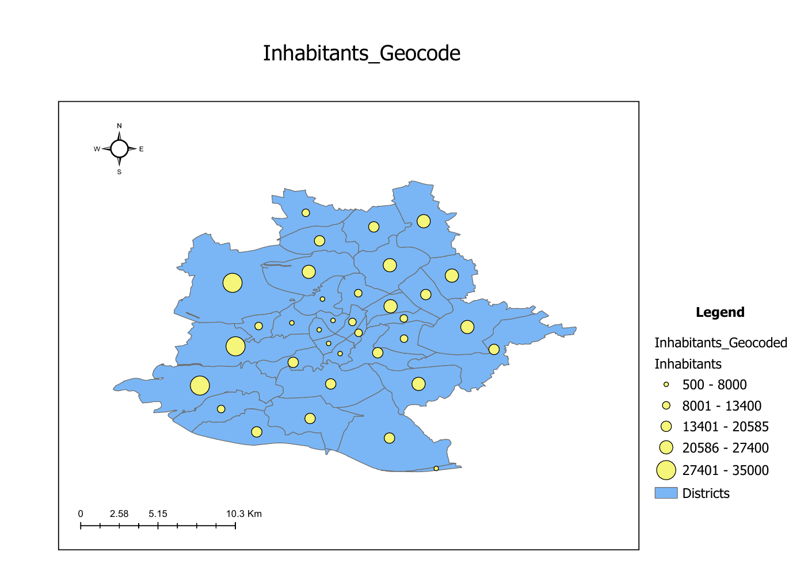

# GIS Spatial Analysis

A GIS project focused on spatial data processing, address geocoding, thematic mapping, and cartographic visualization using ArcGIS Pro.

The project applies GIS workflows to spatial datasets from Stuttgart, Germany, with a focus on transforming tabular and geographic information into interpretable maps.

## Project Overview

The project covers two main GIS workflows:

- Address geocoding and spatial visualization
- Thematic mapping of district-level population data

The analysis combines geospatial data management, geocoding, attribute information, map design, and cartographic visualization.

## Address Geocoding

Address data were geocoded and visualized spatially in ArcGIS Pro.

The resulting map shows the distribution of geocoded locations across Stuttgart together with a detailed view of the University of Stuttgart Vaihingen area.



This workflow demonstrates the transformation of address information into geographic locations that can be explored and analyzed within a GIS environment.

## Thematic Population Mapping

District-level population information was visualized using thematic cartography.

Population values were represented spatially to make differences between geographic areas easier to interpret.



The map combines administrative areas with population attributes and proportional-symbol visualization.

## GIS Workflow

The project involved:

- Managing spatial datasets in ArcGIS Pro
- Working with geodatabases
- Geocoding address data
- Managing spatial and attribute information
- Visualizing point and polygon data
- Creating thematic maps
- Applying proportional-symbol visualization
- Designing map layouts with legends, scale bars, and north arrows
- Exporting final cartographic outputs

## Tools & Technologies

- ArcGIS Pro
- File Geodatabase
- GIS
- Geocoding
- Spatial Data Management
- Thematic Cartography
- Spatial Visualization

## Key Skills Demonstrated

- Geographic Information Systems (GIS)
- Address geocoding
- Spatial data processing
- Geodatabase management
- Attribute data visualization
- Thematic mapping
- Cartographic design
- Spatial data interpretation

## Repository Structure

```text
GIS-Spatial-Analysis/
├── README.md
├── project/
│   └── maedeh_geo.aprx
└── outputs/
    ├── 01-stuttgart-address-geocoding.png
    └── 02-district-population-map.png
```

## Results

The project demonstrates a practical GIS workflow from spatial data preparation and geocoding to thematic visualization and final map production in ArcGIS Pro.
